# Sequence Diagram - Zone Clock

## Core Interaction Sequences

```mermaid
sequenceDiagram
    participant U as 用户
    participant UI as 应用界面
    participant TC as 计时控制器
    participant SM as 状态管理器
    participant NS as 通知服务
    participant DS as 数据存储
    participant SC as 同步服务
    participant API as API网关

    %% 1. 开始专注周期序列 (对应 #REF-UJ-1)
    rect rgb(240, 248, 255)
    Note over U, API: 1. 开始专注周期
    U->>UI: 点击"开始"按钮
    UI->>API: [POST /api/cycles/start]
    API->>SM: 创建新周期
    SM->>DS: 保存周期数据
    DS-->>SM: 返回周期ID
    SM->>TC: 启动90分钟计时器
    TC->>TC: 设置随机微休息(2-5分钟)
    SM-->>API: 返回周期信息
    API-->>UI: 响应{cycleId, status: "active"}
    UI-->>U: 显示倒计时界面
    end

    %% 2. 微休息提醒序列 (对应 #REF-UJ-2)
    rect rgb(255, 248, 240)
    Note over U, API: 2. 微休息提醒(循环)
    TC->>TC: 随机间隔触发(2-5分钟)
    TC->>API: [POST /api/breaks/micro/trigger]
    API->>SM: 记录微休息
    SM->>DS: 保存休息记录

    alt iOS后台
        TC->>NS: 发送本地通知
        NS-->>U: 推送通知+振动
    else macOS/前台
        TC->>UI: 播放提示音
        UI-->>U: 钵声/木鱼声
    end

    TC->>TC: 启动10秒倒计时
    loop 10秒微休息
        TC->>UI: 更新休息倒计时
        UI-->>U: 显示剩余秒数
    end
    TC->>SM: 微休息完成
    SM->>TC: 继续专注计时
    API-->>UI: 响应{breakCount, nextBreak}
    end

    %% 3. 暂停/恢复序列 (对应 #REF-UJ-3)
    rect rgb(240, 255, 240)
    Note over U, API: 3. 暂停与恢复
    U->>UI: 点击"暂停"按钮
    UI->>API: [PUT /api/cycles/{id}/pause]
    API->>SM: 暂停当前周期
    SM->>TC: 暂停所有计时器
    TC-->>SM: 保存当前进度
    SM->>DS: 更新周期状态
    API-->>UI: 响应{status: "paused", remaining}
    UI-->>U: 显示已暂停状态

    U->>UI: 点击"继续"按钮
    UI->>API: [PUT /api/cycles/{id}/resume]
    API->>SM: 恢复周期
    SM->>TC: 恢复计时器
    TC->>TC: 重新计算下次微休息
    API-->>UI: 响应{status: "active"}
    UI-->>U: 恢复倒计时显示
    end

    %% 4. 完成周期进入大休息 (对应 #REF-UJ-4)
    rect rgb(255, 240, 255)
    Note over U, API: 4. 完成专注进入大休息
    TC->>TC: 90分钟倒计时结束
    TC->>API: [POST /api/breaks/long/start]
    API->>SM: 完成当前周期
    SM->>DS: 更新完成统计

    par 并行处理
        SM->>TC: 启动20分钟休息计时
    and
        SM->>NS: 发送完成通知
        NS-->>U: 特殊提示音+通知
    and
        API->>API: [GET /api/statistics/cycle/{id}]
        API-->>UI: 返回本轮统计数据
    end

    UI-->>U: 显示休息倒计时和统计

    loop 20分钟休息
        TC->>UI: 更新休息进度
        UI-->>U: 显示剩余时间
    end

    TC->>SM: 休息结束
    SM->>NS: 发送准备提醒
    NS-->>U: 提醒可以开始新周期
    SM-->>UI: 等待用户操作
    UI-->>U: 显示"开始新周期"按钮
    end

    %% 5. 配置设置序列 (对应 #REF-UJ-5)
    rect rgb(248, 248, 255)
    Note over U, API: 5. 个性化配置
    U->>UI: 进入设置页面
    UI->>API: [GET /api/settings]
    API->>DS: 获取当前设置
    DS-->>API: 返回设置数据
    API-->>UI: 响应{settings}
    UI-->>U: 显示当前配置

    U->>UI: 修改专注时长(15-180分钟)
    UI->>UI: 验证输入范围
    UI->>API: [PUT /api/settings/focus-duration]
    API->>DS: 更新设置
    DS-->>API: 确认更新
    API-->>UI: 响应{success: true}

    U->>UI: 选择/上传提示音
    alt 选择预设音效
        UI->>UI: 播放预览
    else 上传自定义
        UI->>API: [POST /api/settings/sounds/upload]
        API->>DS: 验证并存储音频
    end
    UI->>API: [PUT /api/settings/sounds]
    API->>DS: 更新音效设置
    API-->>UI: 响应{soundId}

    U->>UI: 开启勿扰模式
    UI->>API: [PUT /api/settings/dnd]
    API->>SM: 更新勿扰状态
    SM->>NS: 暂停所有通知
    API-->>UI: 响应{dndEnabled: true}
    UI-->>U: 显示勿扰图标
    end

    %% 6. 数据统计序列 (对应 #REF-UJ-6)
    rect rgb(255, 255, 240)
    Note over U, API: 6. 查看统计数据
    U->>UI: 打开统计页面

    par 并行获取数据
        UI->>API: [GET /api/statistics/today]
        API->>DS: 查询今日数据
        DS-->>API: 返回今日统计
    and
        UI->>API: [GET /api/statistics/history]
        API->>DS: 查询30天历史
        DS-->>API: 返回历史记录
    and
        UI->>API: [GET /api/statistics/trends]
        API->>DS: 分析趋势数据
        DS-->>API: 返回趋势分析
    end

    API-->>UI: 聚合统计数据
    UI->>UI: 渲染图表
    UI-->>U: 显示完整统计视图
    end

    %% 7. 跨设备同步序列 (对应 #REF-UJ-7)
    rect rgb(240, 255, 255)
    Note over U, API: 7. 跨设备数据同步
    Note over SC: 自动触发或手动同步

    alt 自动同步
        SM->>SC: 数据变更触发
    else 手动同步
        U->>UI: 点击同步按钮
        UI->>API: [POST /api/sync/trigger]
        API->>SC: 触发同步
    end

    SC->>DS: 获取本地数据版本
    SC->>SC: 连接iCloud容器

    alt 有网络连接
        SC->>SC: 比较数据版本
        alt 本地更新
            SC->>SC: 上传本地数据
            SC-->>DS: 更新同步时间戳
        else 远程更新
            SC->>SC: 下载远程数据
            SC->>DS: 合并数据
            DS->>SM: 刷新应用状态
            SM->>UI: 更新界面
        else 冲突
            SC->>SC: 应用冲突解决策略
            SC->>DS: 保留最新版本
        end
        SC-->>API: 同步完成
        API-->>UI: 响应{syncStatus: "success"}
    else 无网络
        SC->>DS: 缓存待同步数据
        SC-->>API: 响应{syncStatus: "pending"}
    end

    UI-->>U: 显示同步状态
    end
```

## API Call Mappings in Sequences

### 核心API调用时序
1. **启动周期**: `POST /api/cycles/start` → 初始化计时器
2. **触发微休息**: `POST /api/breaks/micro/trigger` → 10秒倒计时
3. **暂停/恢复**: `PUT /api/cycles/{id}/pause|resume` → 计时器控制
4. **进入大休息**: `POST /api/breaks/long/start` → 20分钟倒计时
5. **更新设置**: `PUT /api/settings/*` → 即时生效或下轮生效
6. **获取统计**: `GET /api/statistics/*` → 并行数据查询
7. **数据同步**: `POST /api/sync/trigger` → iCloud同步流程

## Cross-Reference Notes
- 每个Rectangle块对应User Journey中的一个主要阶段
- API调用使用[方括号]标注，保持与其他视图一致
- 条件分支(alt/opt)反映了状态图中的决策节点