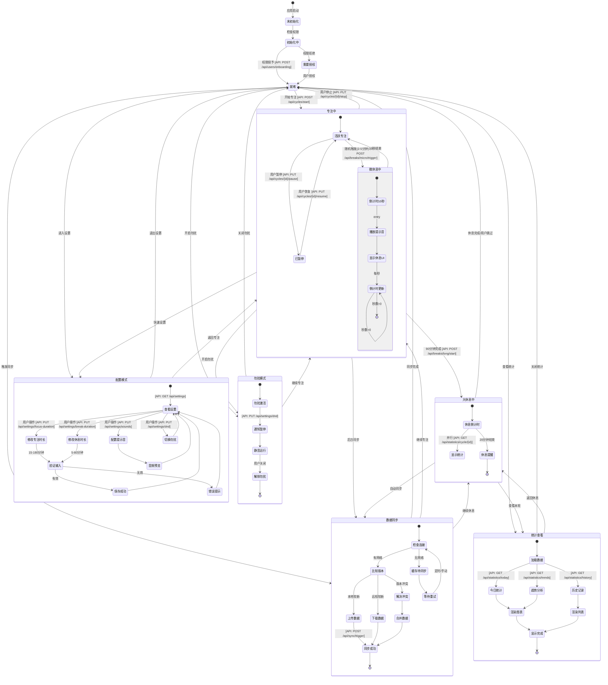

# State Diagram - Zone Clock

## System State Machine

## State Transition Rules

### 核心状态转换映射

| 起始状态 | 触发条件 | API调用 | 目标状态 |
|---------|---------|---------|---------|
| 就绪 | 用户点击开始 | POST /api/cycles/start | 专注中 |
| 活跃专注 | 随机2-5分钟 | POST /api/breaks/micro/trigger | 微休息中 |
| 微休息中 | 10秒结束 | 自动 | 活跃专注 |
| 活跃专注 | 用户暂停 | PUT /api/cycles/{id}/pause | 已暂停 |
| 已暂停 | 用户恢复 | PUT /api/cycles/{id}/resume | 活跃专注 |
| 专注中 | 90分钟完成 | POST /api/breaks/long/start | 大休息中 |
| 大休息中 | 20分钟结束 | 自动 | 就绪 |
| 任何状态 | 进入设置 | GET /api/settings | 配置模式 |
| 任何状态 | 开启勿扰 | PUT /api/settings/dnd | 勿扰模式 |
| 任何状态 | 触发同步 | POST /api/sync/trigger | 数据同步 |

### 状态不变量（守恒规则）

1. **专注状态守恒**: 专注中的子状态（活跃/暂停/微休息）总时长 = 设定的专注时长
2. **休息状态守恒**: 微休息次数 × 10秒 + 大休息时长 = 总休息时长
3. **数据一致性守恒**: 本地状态 + 同步差异 = 云端状态
4. **设置生效守恒**: 当前设置 + 修改项 = 新设置（下轮生效）

## Cross-Reference Mappings

### 状态与用户旅程映射
- **就绪** ← #REF-UJ-1 (用户选择开始)
- **专注中** ← #REF-UJ-2 (微休息循环)
- **已暂停** ← #REF-UJ-3 (暂停决策)
- **大休息中** ← #REF-UJ-4 (周期完成)
- **配置模式** ← #REF-UJ-5 (个性化配置)
- **统计查看** ← #REF-UJ-6 (数据查看)
- **数据同步** ← #REF-UJ-7 (跨设备同步)

### 状态与时序图映射
- 每个状态转换对应时序图中的一个Rectangle块
- 状态内的活动对应时序图中的消息交互
- 并行状态对应时序图中的par块
- 条件转换对应时序图中的alt块

## Business Logic Conservation Verification
- ✓ 所有用户动作都有对应的状态转换
- ✓ 所有状态转换都绑定了API调用
- ✓ 状态机完整覆盖了业务需求中的所有场景
- ✓ 没有孤立状态，所有状态都可达且可退出