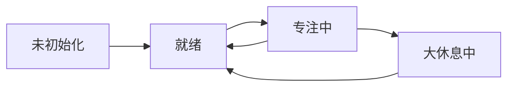

# Zone Clock - 专注力管理助手

[](/.futurxlab/contracts/system.contract.yaml)
[](https://swift.org)
[](https://developer.apple.com/ios/)
[](https://developer.apple.com/macos/)

## 项目概述

Zone Clock 是一款基于**契约驱动开发（CDD）**方法论构建的专注力管理应用。通过科学的90分钟专注周期和随机微休息机制，帮助用户保持高效专注。

## 核心特性

### 🎯 科学专注管理
- **90分钟专注周期**：基于大脑注意力规律的最佳时长
- **20分钟大休息**：充分恢复，准备下一轮专注
- **可自定义时长**：15-180分钟专注，5-60分钟休息

### ⚡ 随机微休息
- **2-5分钟随机触发**：防止用户预期，维持注意力张力
- **固定10秒时长**：足够打断疲劳，又不破坏工作状态
- **暂停时不触发**：智能管理休息时机

### 📊 数据统计
- **今日统计**：实时追踪专注时长和完成率
- **历史记录**：30天专注历史回顾
- **趋势分析**：发现最佳专注时段

### 🔔 智能提醒
- **多样化提示音**：钵声、木鱼声、水滴声
- **勿扰模式**：专注时屏蔽干扰
- **振动提醒**：适配iOS设备

### ☁️ 跨设备同步
- **iCloud同步**：所有Apple设备数据同步
- **冲突解决**：智能处理数据冲突
- **离线支持**：无网络时本地优先

## 项目结构

```
zoneclock/
├── .futurxlab/                # 契约和文档
│   ├── contracts/
│   │   ├── system.contract.yaml   # 系统契约
│   │   └── validate.swift         # 契约验证器
│   ├── user-journey.md            # 用户旅程图
│   ├── sequence-diagram.md        # 时序图
│   ├── state-diagram.md           # 状态图
│   └── api-spec.yaml              # API规范
├── zoneclock/                 # 源代码
│   ├── Models/               # 数据模型
│   │   ├── Cycle.swift
│   │   ├── Break.swift
│   │   ├── Settings.swift
│   │   └── Statistics.swift
│   ├── Controllers/          # 控制器
│   │   ├── StateManager.swift
│   │   └── TimerController.swift
│   ├── Services/             # 服务
│   │   └── NotificationManager.swift
│   ├── Views/                # 视图
│   │   ├── MainView.swift
│   │   ├── SettingsView.swift
│   │   ├── StatisticsView.swift
│   │   └── OnboardingView.swift
│   └── ContentView.swift
└── README.md

```

## 契约驱动开发（CDD）

本项目严格遵循契约驱动开发方法论：

### 📋 契约即宪法
- 所有开发必须遵守 `system.contract.yaml`
- 契约定义了命名规则、路径、时间规则、业务逻辑等
- 通过自动验证确保代码符合契约

### ✅ 自动验证
```bash
# 运行契约验证
swift .futurxlab/contracts/validate.swift
```

### 🔄 业务逻辑守恒
```
Info(用户旅程) = Info(时序图) = Info(状态图) = Info(API规范)
```

## 快速开始

### 前置要求
- Xcode 15.0+
- iOS 17.0+ / macOS 14.0+
- Swift 5.9+

### 构建运行

1. 打开项目
```bash
open zoneclock.xcodeproj
```

2. 选择目标设备（iPhone模拟器或Mac）

3. 点击运行按钮或按 `Cmd+R`

### 开发流程

1. **修改前先读契约**
```bash
cat .futurxlab/contracts/system.contract.yaml
```

2. **按契约开发代码**
- 遵循命名规则
- 使用正确的路径
- 实现必需的业务规则

3. **验证契约合规性**
```bash
swift .futurxlab/contracts/validate.swift
```

4. **运行测试**
```bash
# 在Xcode中运行单元测试
Cmd+U
```

## 核心业务规则

| 规则ID | 名称 | 描述 | 实施级别 |
|--------|------|------|----------|
| BR001 | 单周期原则 | 同时只能有一个活跃的专注周期 | 严格 |
| BR002 | 微休息随机性 | 微休息必须在2-5分钟随机触发 | 严格 |
| BR003 | 微休息固定时长 | 微休息固定10秒，不可配置 | 严格 |
| BR004 | 手动开始原则 | 新周期必须由用户手动开始 | 严格 |
| BR005 | 暂停状态无微休息 | 暂停状态下不触发微休息 | 严格 |
| BR006 | 勿扰模式静音 | 勿扰模式下屏蔽所有通知 | 严格 |

## 状态机



## API映射

| 用户动作 | API调用 | 状态转换 |
|---------|---------|---------|
| 开始专注 | POST /api/cycles/start | 就绪→专注中 |
| 触发微休息 | POST /api/breaks/micro/trigger | 活跃→微休息中 |
| 暂停/恢复 | PUT /api/cycles/{id}/pause\|resume | 活跃⟷暂停 |
| 完成周期 | POST /api/breaks/long/start | 专注中→大休息中 |

## 贡献指南

1. Fork 项目
2. 创建功能分支 (`git checkout -b feature/AmazingFeature`)
3. 确保通过契约验证
4. 提交更改 (`git commit -m 'Add some AmazingFeature'`)
5. 推送到分支 (`git push origin feature/AmazingFeature`)
6. 开启 Pull Request

## 许可证

MIT License

## 联系方式

- 项目维护：Zone Clock CDD System
- 契约版本：1.0.0
- 生成日期：2025-01-02

---

*基于契约驱动开发（CDD）方法论构建*
*契约即宪法，验证即执法*